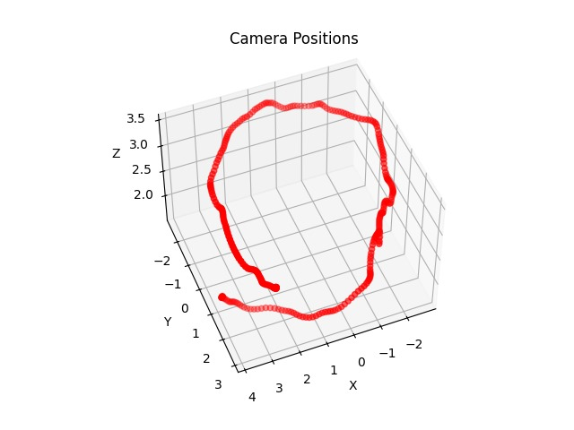
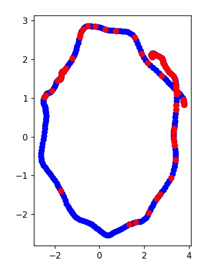
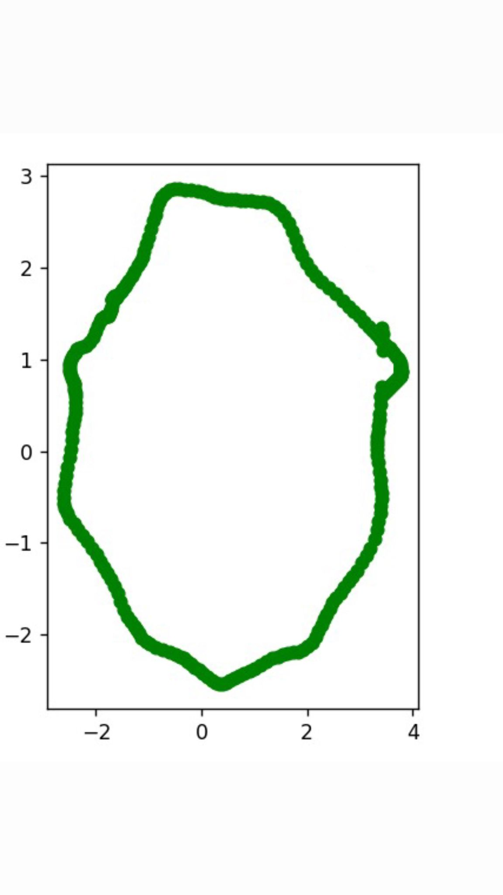
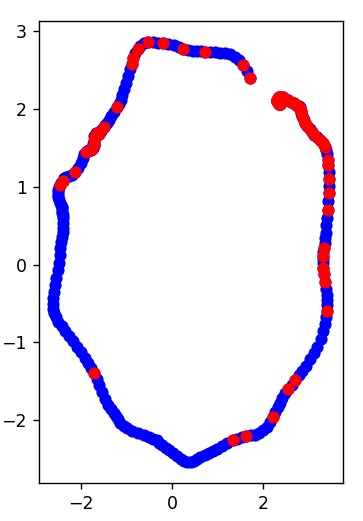
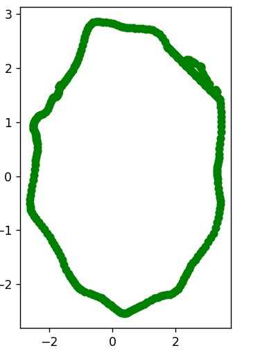
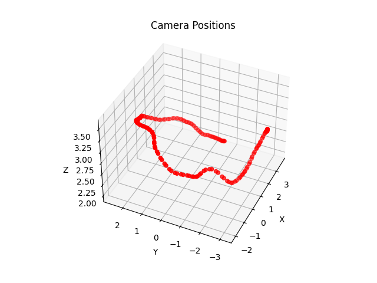
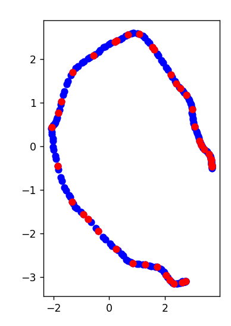
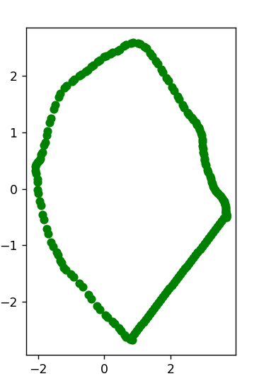

# Fixing gif using Neural Radiance Fields (NeRF)  
Creating a fixed gif through the application of Neural Radiance Fields (NeRF) involves achieving seamless transitions between the initial and concluding frames. The goal is to ensure that the human eye cannot discern the starting and ending points of the image sequence. In essence, the action depicted in the gif should give the illusion of perpetual repetition rather than a conventional playback experience.
  
results of a *fixed gif*:  

  

# Data 
I photographed two different objects. The first under good conditions and without any obstacles, while the second had a lot of variation in light conditions around it.
you can find all the data under ./extra folder 

# Work process
**0. Source gif,** 
generate gif using a set of images.

**1. Determine the camera position for each image using colmap,** 
Colmap, a structure-from-motion framework, was utilized to generate camera positions based on a series of images. The resulting distribution of camera positions is illustrated, with black points representing frame numbers. The blue points track the camera operator's trajectory around the assumed object position at (0,0,0). Notably, the camera holder completed a revolution exceeding 360 degrees, suggesting a failure to return to the initial position. Vertical movement along the Z-axis is also observed, indicating fluctuations in height as the person recorded the video.

**2. Train NeRF on the extracted images,** 
incorporating the generated camera positions. Utilize the TensoRF framework to train NeRF specifically for the scene or object.
In this segment, we had the flexibility to opt for any iteration of NeRF. Our choice fell upon TensoRF, available at https://apchenstu.github.io/TensoRF/.

**3. form a closed circle,** 
Pick the right points to form a closed circle around the object.
I tried different ways to find the best circle, I will try to explain how the Algorithm goes, we are trying to fix the camera position by completing a circle, so I used the distance of the starting point and then trying to find the point where a complete 360-degree rotation around the object has been achieved, for some exaples I use to delete some starting points to get better results after checking the camera position.(we can see it in the first scene)

**4. Generate new images,** 
Employ the trained NeRF network on the missed points to generate new images.

**5. Fixed GIF,** 
generate gif using a the final set of images, includes the generated ones

# First Scene:
I tried two different closed circles, and will show the difirance between the two results.
In this scene, I attempted to find two methods to complete the required circle. As we can observe, the second result is smoother and better, highlighting the necessity of choosing the optimal approach in section 3.

## 5. First option
### 0. Source gif 

  

### 1. Camera Positions 
all the data under /extra/first_scene/json_data

  

### 3. Find a perfect closed circle  

  

  

### 4. Generate new images
all the data under /extra/firstscene/images

### 5. Fixed gif  

  

## 5. Second option
TODO
### 3. Find a perfect closed circle  

  

  

### 5. Fixed gif  

  

# Second Scene:
In this scene, I attempted to select images with various lighting conditions from different angles, aiming to introduce a variety of shadows and distinct reflections based on the shooting perspective.

### 0. Source gif 

  

### 1. Camera Positions 
all the data under /extra/second_scene/json_data

  

### 3. Find a perfect closed circle  

  

  

### 4. Generate new images
all the data under /extra/second_scene/images

### 5. Fixed gif  

  

